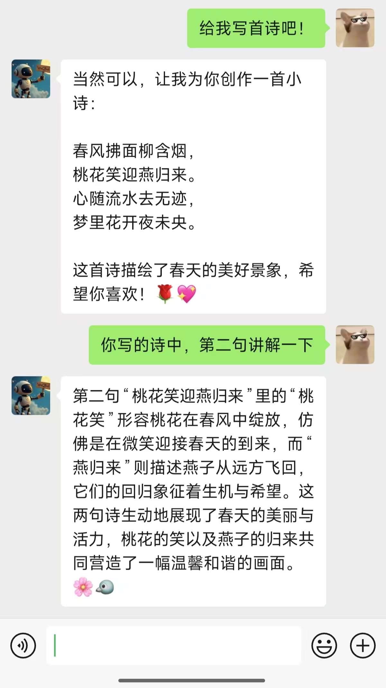

# WeQBot 🤖💬 [v2.4.21]

基于 Qwen2.5-3B 的智能微信助手 | 终端交互 + 一键部署 |





## 目录
- [✨ 全新特性](#-全新特性)
- [🚀 极速部署](#-极速部署)
  - [一键环境配置](#一键环境配置)
  - [交互式启动](#交互式启动)
- [🤖 模型下载](#-模型下载)
- [📊 日志系统](#-日志系统)
- [❓ 常见问题](#-常见问题)

## ✨ 全新特性
🎯 **v2.0 重要升级**：
- **终端交互界面**：告别手动编辑代码，所有操作通过命令行完成
- **改用Qwen2.5-3B**：响应速度提升 40%，平均回复时间 ≤5s (RTX4060 8GB显存)
- **智能日志系统**：新增日志模式，记录存储到 `log.txt` 文件
- **Conda 一键部署**：通过 environment.yaml 快速复现环境

```diff
+ 旧版本用户请注意：本项目不再兼容 v1.x 的配置文件格式
```

## 🚀 极速部署

### 一键环境配置
```bash
# 从 environment.yaml 创建环境
conda env create -f environment.yaml
```

### 如何启动
```bash
# 启动模型服务 (自动检测GPU)
python main.py

```
**使用终端**：
```bash
>>> 是否启用日志模式(Y/N): y
>>> 请输入要回复的目标: 测试账号
```
## 🤖 模型下载
**访问Qwen2.5-3B-Instruct的huggingface官网下载(https://huggingface.co/Qwen/Qwen2.5-3B-Instruct/tree/main)**
**使用百度网盘链接: https://pan.baidu.com/s/18De9CHgONRyJuiPCg_lLZg?pwd=wbot 提取码:wbot**
- 请把下载的模型文件夹放入‘model’文件夹中,确保模型文件夹名字为qwen2.5_3B
- 架构:
```text
model
├── qwen2.5_3B            # 微信客户端 (含交互界面)

```
## 📊 日志系统
**日志文件示例** (`logs.txt`)：


## ❓ 常见问题
**Q：如何更换监听对象？**  
- 重新运行程序键入监听对象

**Q：首次启动模型加载慢？**  
- 这是正常现象，模型需完全加载到内存

**Q：支持多语言回复吗？**  
- 当前默认支持中英文

---

**许可证**  
[MIT License](LICENSE) © 2025 [Liuce CN]
